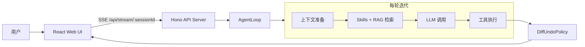
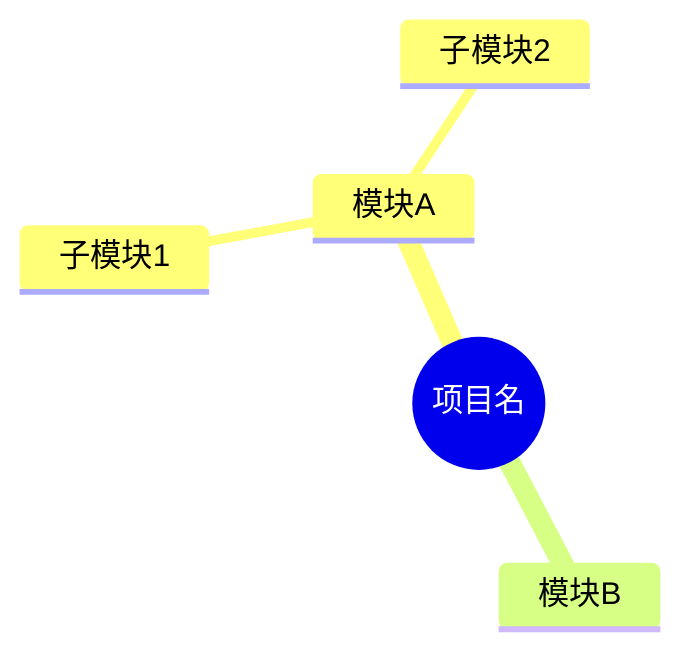

# Agent 指令

当被问到"了解当前项目"、"项目概览"、"项目介绍"或类似问题时，必须按以下 7 个维度进行全面回答，并用 Mermaid 图表可视化架构。

## 执行步骤

### 步骤 1: 并行获取项目元信息
```bash
# 同时读取
cat package.json     # 名称、版本、描述、脚本、依赖
cat tsconfig.json    # TypeScript 配置
cat README.md        # 项目文档
```

### 步骤 2: 扫描目录结构（深度 2-3 层）
```bash
find . -maxdepth 2 -type d ! -path './node_modules/*' ! -path './.git/*' ! -path './.agent/node_modules/*' | sort
```

### 步骤 3: git 提交历史
```bash
git log --oneline -10
git branch -a
```

### 步骤 4: 关键入口文件概览
```bash
# 读每个文件前 30 行
cat src/index.ts
cat server/main.ts
cat server/api.ts
cat web/src/App.tsx
```

### 步骤 5: Agent 自身配置
```bash
ls -la .opencode/
```

### 步骤 6: 运行态数据
```bash
ls -la .agent/
```

### 步骤 7: 读取现有 AGENTS.md
```bash
cat AGENTS.md 2>/dev/null
```

## 回答结构

回答必须包含以下部分，不可遗漏：

### 1. 项目定位 + 技术栈（加粗关键信息）

### 2. Mermaid 图表：系统架构总览图



- Mermaid 语法必须正确，用 `flowchart` 而非 `graph`
- 节点使用方括号 `[text]` 或圆括号 `(text)` 标注角色
- 子图用 `subgraph ... end` 包裹

### 3. Mermaid 图表：核心模块依赖图

列出 src/ 下主要子模块及其关系。

### 4. Mermaid 图表：目录结构 Mindmap



### 5. API 路由表格

| 路由 | 说明 |
|------|------|

### 6. 最近 git 活动

### 7. 注意事项（来自 README 已知问题）
