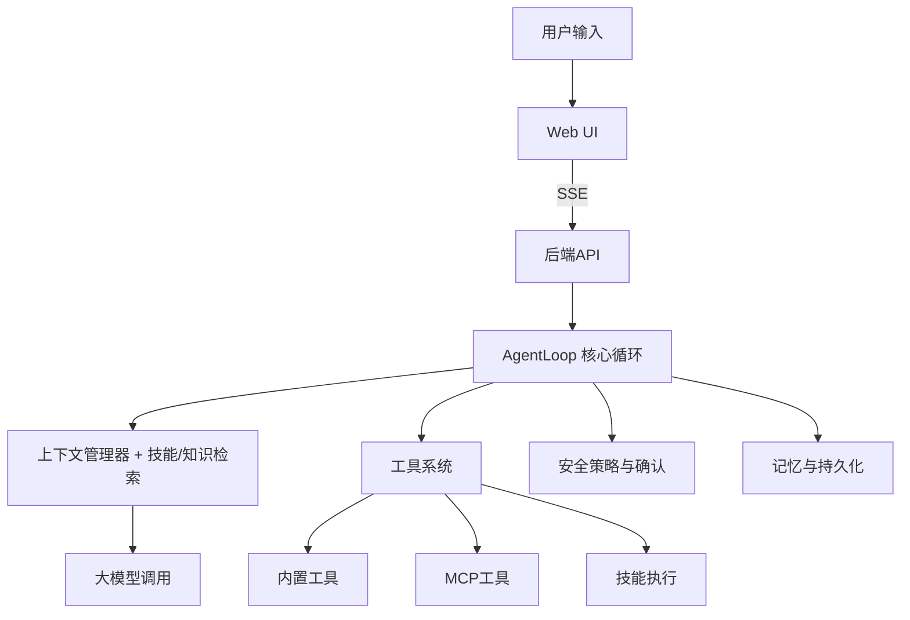

## 🔍 当前架构总览

```
agentkit/
├── src/                        # 框架核心源码
│   ├── index.ts                # 统一导出入口
│   ├── types/                  # 基础类型与接口定义
│   ├── core/                   # 核心抽象：Agent循环、工具、策略、记忆、状态管理
│   ├── tools/                  # 内置工具实现（文件、Bash、搜索等）
│   ├── skills/                 # 技能系统：创建、管理、执行、模板库
│   ├── mcp/                    # MCP客户端：标准协议连接外部工具服务
│   ├── rag/                    # RAG知识库：文档索引与向量检索
│   ├── vector/                 # 向量存储（文件向量）、嵌入生成
│   ├── storage/                # 持久化存储（SQLite会话、消息、记忆）
│   ├── context/                # 上下文管理（滑动窗口、Token计数、压缩）
│   ├── policy/                 # 安全策略（Diff确认、权限控制、回滚）
│   ├── memory/                 # 记忆系统实现（文件/向量记忆）
│   └── utils/                  # 工具函数（Diff、备份、日志、重试、沙箱）
├── server/                     # 后端服务（SSE推送、API路由）
│   ├── main.ts                 # 服务启动（Bun + Hono）
│   └── api.ts                  # REST/SSE API实现
├── web/                        # 前端应用（React + Ant Design X）
│   ├── src/
│   │   ├── providers/          # 状态管理（ChatProvider、角色、工作区）
│   │   ├── components/         # UI组件（聊天、侧边栏、角色选择器、技能面板）
│   │   ├── hooks/              # 自定义Hooks（确认、记忆、会话历史）
│   │   ├── data/               # 预设数据（角色库等）
│   │   └── App.tsx             # 主布局
│   └── package.json
├── examples/                   # 使用示例（独立开发者Agent等）
├── tests/                      # 单元测试与集成测试
├── setup.ts                    # 脚手架一键生成脚本
├── .env.example                # 环境变量示例
└── README.md
```

**核心数据流：**


---


# AgentKit — 通用 AI Agent 开发框架

一个基于 TypeScript 的**企业级 AI Agent 框架**，集成了技能管理、MCP 标准协议、RAG 私有知识库与现代化 Web 交互界面。

## ✨ 核心特性

- 🤖 **智能体循环**：多轮思考-行动-观察，支持子任务拆分与角色扮演
- ⚙️ **Skills 技能系统**：可复用的工作流模板，自动创建、存储与执行
- 🔌 **MCP 协议**：通过标准化接口连接任意外部工具和服务
- 🧠 **RAG 知识引擎**：基于向量的文档检索，让回答有据可依
- 🛡️ **安全策略**：文件修改 Diff 预览、权限控制、操作回滚与审计
- 💾 **会话持久化**：SQLite 存储对话历史、记忆，支持崩溃恢复
- 🎨 **现代 UI**：React + Ant Design X，支持暗色模式、流式响应、代码高亮
- 🧩 **动态角色**：内置多种职业角色，支持自定义角色模板
- 🔁 **错误自愈**：指数退避重试、工具降级策略
- 📦 **零依赖启动**：Bun 一键运行，内置向量存储与文件数据库

## 📂 项目结构

```
agentkit/
├── src/                      # 框架核心
│   ├── core/                 # Agent循环、策略、记忆等抽象
│   ├── tools/                # 内置工具集合
│   ├── skills/               # 技能管理器与执行器
│   ├── mcp/                  # MCP 客户端
│   ├── rag/                  # 知识库与检索
│   ├── vector/               # 向量存储与嵌入
│   ├── context/              # 上下文压缩与 Token 管理
│   ├── policy/               # 安全与确认策略
│   ├── memory/               # 记忆后端
│   ├── storage/              # SQLite 持久化
│   └── utils/                # 工具库（diff、备份、重试等）
├── server/                   # Bun 后端服务
├── web/                      # React 前端应用
├── examples/                 # 接入示例
├── tests/                    # 测试用例
├── setup.ts                  # 一键生成脚手架
├── .env.example              # 环境配置示例
└── README.md
```

## 🚀 快速开始

### 前提条件

- [Bun](https://bun.sh) >= 1.0
- OpenAI API Key（或兼容接口）

### 1. 初始化项目

```bash
# 克隆项目后运行初始化脚本
bun run setup.ts
```

### 2. 配置环境

```bash
cp .env.example .env
# 编辑 .env，填入 API Key 和（可选）代理地址
```

### 3. 启动后端

```bash
bun run --env-file .env server/main.ts
```

### 4. 启动前端（另一个终端）

```bash
cd web
bun install
bun run dev
```

打开 `http://localhost:5173` 即可与 Agent 对话。

## 🧠 核心概念

### Agent Skills（技能系统）
技能是预定义的工具调用序列，保存为 Markdown 文件。你可以通过对话让 Agent 创建技能，也可手动在 `.agent/skills/` 目录下编写。

- **创建技能**：“创建一个部署前端的技能，包含构建和上传步骤”
- **调用技能**：“用 frontend-deploy 技能部署当前项目”
- **列出技能**：“显示所有可用技能”

### MCP（模型上下文协议）
通过标准协议连接外部工具。在 `server/api.ts` 中配置 MCP 服务器：

```ts
import { MCPClient } from '../src/mcp/mcp-client';
const mcp = new MCPClient();
await mcp.connectServer('filesystem', 'npx', ['-y', '@modelcontextprotocol/server-filesystem', '/path/to/dir']);
```

### RAG（检索增强生成）
将私有文档放入 `.agent/docs/` 目录，启动时自动索引。Agent 回答相关问题时会自动检索并引用文档内容。

### 角色扮演
内置资深程序员、产品经理、翻译官等角色，支持自定义。通过界面下拉菜单一键切换，Agent 会调整回复风格。

## 🛠 开发指南

### 添加新工具
继承 `Tool` 基类并实现 `execute` 方法，然后在 Agent 初始化时注册：

```ts
class MyTool extends Tool {
  name = 'my_tool';
  description = '...';
  parameters = z.object({ ... });
  async execute(params) { ... }
}
```

### 运行测试
```bash
bun test
```

### 打包部署
前端构建：
```bash
cd web && bun run build
```
后端可直接用 Bun 启动 `server/main.ts`，也可打包为单文件。

## 🤝 贡献

欢迎提交 Issue 和 PR，一起完善这个通用 Agent 框架。

## 📄 许可

MIT
