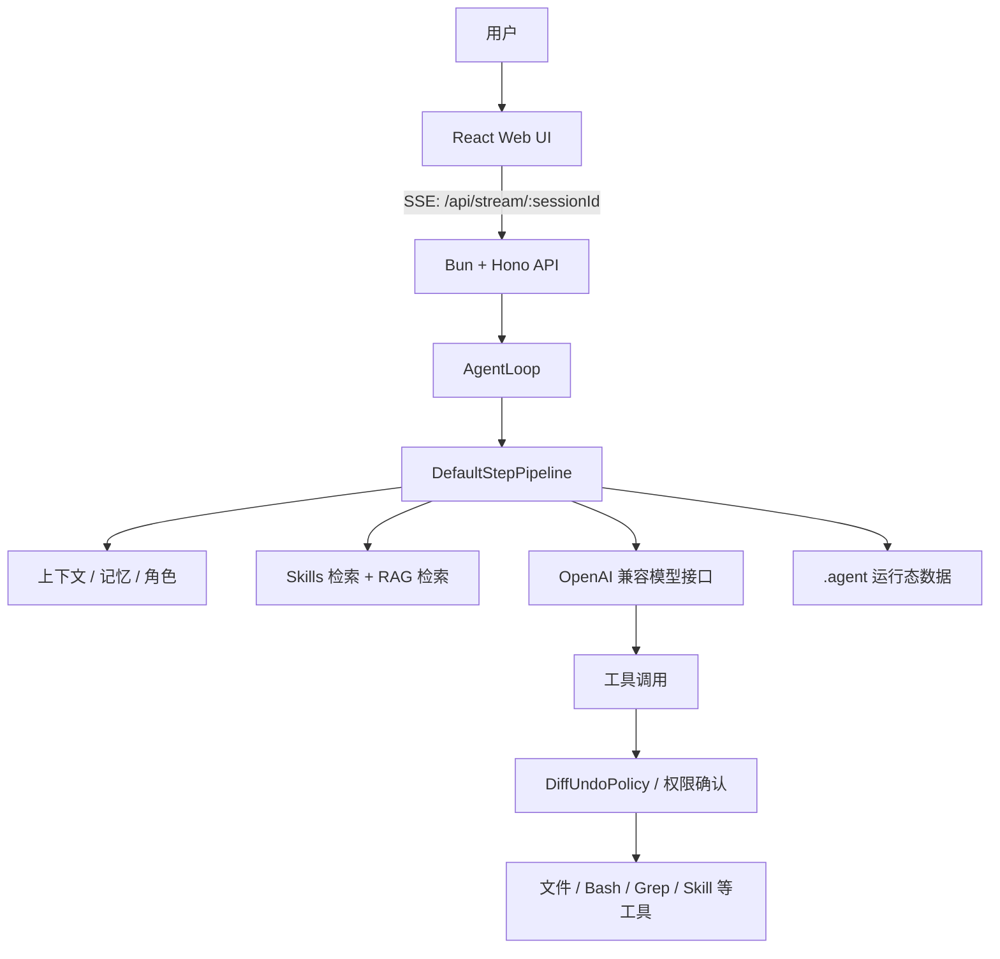

# AgentKit

AgentKit 是一个基于 TypeScript + Bun 的 AI Agent 开发框架。它把大模型调用、工具执行、技能复用、RAG 知识库、人工确认、前端对话界面和后端 API 放在同一个项目里，适合做“可使用工具的企业内部 Agent”原型或二次开发底座。

## 项目解读

这个项目不是单纯的聊天 UI，而是一套完整的 Agent 执行链：

1. Web 前端通过 SSE 把用户输入发送到后端。
2. 后端按会话创建或复用 `AgentLoop`。
3. `AgentLoop` 每轮调用 `DefaultStepPipeline`，完成角色注入、记忆注入、Skills/RAG 检索、模型调用和工具调用。
4. 工具执行前会经过策略检查。涉及文件写入等高风险操作时，会通过事件总线推送确认请求，前端展示 diff 后由用户批准或拒绝。
5. 会话记忆、模型配置、技能、知识库向量、定时任务和备份等运行态数据写入 `.agent/`。



## 核心能力

- **Agent 循环**：`src/core/agent-loop.ts` 负责多轮迭代，默认最多 15 轮。
- **步骤管线**：`src/core/default-step-pipeline.ts` 负责上下文准备、模型调用、工具调用解析、并行安全工具执行、重复调用检测和降级处理。
- **工具系统**：内置文件读取/写入、Bash、Grep、Glob、WebFetch、WebSearch、EditFile、JsonQuery、Git、通知、归档等工具；当前聊天路由默认注册了读取、写入、Bash、Grep 和 Skills 相关工具。
- **安全策略**：`DiffUndoPolicy` 对写操作生成 diff，并通过 `/api/confirm` 等待用户确认。
- **Skills**：Markdown 格式的可复用步骤模板，存储在 `.agent/skills/`，支持元数据扫描、按需加载和向量检索。
- **RAG 知识库**：上传文档到 `.agent/docs/` 后建立向量索引，聊天时按问题检索相关片段。
- **模型配置**：模型、baseURL、API Key、温度、max tokens 等保存在 `.agent/config.db`。
- **Web UI**：React + Vite + Ant Design，包含对话、技能、市场、知识库、定时任务和设置页面。
- **定时任务**：`src/cron/` + `/api/cron` 支持 cron 表达式的任务管理。
- **异步队列**：`/api/agents/async` 可接入 BullMQ + Redis 执行后台任务。
- **IM 适配**：预留企业微信、钉钉、飞书适配器，通过环境变量启用。

## 目录结构

```text
.
├── src/                    # AgentKit 核心框架
│   ├── core/               # AgentLoop、StepPipeline、事件、状态、策略抽象
│   ├── tools/              # 内置工具
│   ├── skills/             # 技能管理、执行和模板
│   ├── rag/                # 知识库索引与检索
│   ├── vector/             # 文件向量存储和 embedding 生成
│   ├── memory/             # 会话记忆实现
│   ├── storage/            # SQLite 配置/会话存储
│   ├── policy/             # 权限、确认、diff/undo 策略
│   ├── cron/               # 定时任务存储与调度
│   ├── queue/              # BullMQ 异步任务队列
│   ├── im/                 # 企业微信/钉钉/飞书消息适配
│   └── observability/      # 日志与遥测
├── server/                 # Hono API 服务
│   ├── main.ts             # Bun 服务入口，默认端口 3000
│   ├── api.ts              # 路由挂载
│   ├── context.ts          # 全局 Skill/RAG/模型配置/MCP 实例
│   └── routes/             # chat、skills、rag、market、cron、settings 等路由
├── web/                    # React 前端
│   ├── src/pages/          # 对话、技能、市场、知识库、定时任务、设置页面
│   ├── src/components/     # 消息、确认框、角色、工作区、diff 等组件
│   └── vite.config.ts      # dev server 代理 /api 到 localhost:3000
├── examples/               # 命令行 Agent 示例
├── tests/                  # Bun 测试
├── setup.ts                # 初始化脚本
├── Dockerfile              # 后端 + 前端构建镜像
└── docker-compose.yml      # Redis、Agent、OTel Collector、Grafana 示例
```

## 快速启动

### 1. 安装依赖

```bash
bun install
cd web
bun install
cd ..
```

### 2. 配置环境变量

```bash
cp .env.example .env
```

至少需要配置：

```bash
OPENAI_API_KEY=sk-...
OPENAI_MODEL=gpt-4o
OPENAI_BASE_URL=https://api.openai.com/v1
```

如果使用兼容 OpenAI API 的服务，修改 `OPENAI_BASE_URL` 和 `OPENAI_MODEL` 即可。向量检索默认使用 `text-embedding-3-small`，可通过 `EMBEDDING_API_KEY`、`EMBEDDING_BASE_URL` 单独配置；如果暂时不需要 Skills/RAG 向量检索，可以设置：

```bash
DISABLE_VECTOR_SEARCH=true
```

### 3. 启动后端

```bash
bun run server
```

后端默认监听 `http://localhost:3000`，健康检查：

```bash
curl http://localhost:3000/health
```

### 4. 启动前端

```bash
cd web
bun run dev
```

打开 `http://localhost:5173`。Vite 会把 `/api` 代理到 `http://localhost:3000`。

## 常用命令

```bash
bun run setup          # 执行初始化脚本
bun run server         # 启动 Hono 后端
bun run dev            # 启动 examples/dev-agent.ts 命令行示例
bun test               # 运行测试
cd web && bun run dev  # 启动前端开发服务
cd web && bun run build # 构建前端
```

## 主要 API

| 路由 | 说明 |
| --- | --- |
| `GET /health` | 服务健康检查 |
| `GET /api/stream/:sessionId?input=...` | SSE 对话流 |
| `POST /api/confirm` | 写操作 diff 确认 |
| `GET/PUT/POST /api/model-config` | 读取或更新模型配置 |
| `GET /api/skills` | 列出本地技能 |
| `GET /api/skills/:name` | 查看技能详情 |
| `DELETE /api/skills/:name` | 删除技能 |
| `POST /api/skills/reload` | 重载技能元数据 |
| `POST /api/rag/upload` | 上传知识库文档并重建索引 |
| `GET /api/rag/status` | 查看知识库文件状态 |
| `GET/POST/PUT/DELETE /api/cron` | 管理定时任务 |
| `POST /api/agents/async` | 提交 Redis/BullMQ 异步 Agent 任务 |
| `GET /api/market/skills` | 获取技能市场列表 |
| `GET /api/market/mcp` | 获取 MCP 市场列表 |

## 运行态数据

项目运行时会自动创建 `.agent/`，常见内容包括：

```text
.agent/
├── skills/                  # 本地技能 Markdown
├── docs/                    # RAG 上传文档
├── backups/                 # 文件修改备份
├── config.db                # 模型配置 SQLite
├── cron.db                  # 定时任务 SQLite
├── knowledge-vectors.json   # 知识库向量
└── *_memory.json            # 会话记忆
```

这些文件通常属于本地运行数据。是否提交到仓库，需要按部署方式和数据敏感性单独判断。

## 开发入口

### 创建 Agent

`server/routes/chat.ts` 会根据请求参数和模型配置构造 Agent：

- 模型配置来自 query 参数、`.agent/config.db` 或环境变量。
- 记忆写入 `.agent/${sessionId}_memory.json`。
- 上下文窗口使用 `SlidingWindowContextManager`。
- 写操作策略使用 `DiffUndoPolicy`。
- Skills、RAG、MCP 实例来自 `server/context.ts`。

### 添加工具

新工具应继承 `Tool` 抽象，并提供：

- `name`
- `description`
- `parameters`
- `execute(params)`

实现后在 `src/tools/index.ts` 导出，并在创建 Agent 的地方注册。

### 添加页面

前端入口是 `web/src/App.tsx`。当前页面包括：

- `/` 对话
- `/skills` 技能
- `/market` 市场
- `/knowledge` 知识库
- `/cron` 定时任务
- `/settings` 设置

## Docker

```bash
docker compose up --build
```

`docker-compose.yml` 会启动 Redis、Agent、OpenTelemetry Collector 和 Grafana 示例服务。生产部署时需要补齐 `.env`，并根据实际需求决定是否启用 Redis、OTel 和 Grafana。

## 当前注意事项

- `server/api.ts` 中鉴权中间件写在路由挂载之后；如果需要生产级 API 鉴权，应调整中间件挂载顺序并明确哪些接口需要保护。
- `examples/dev-agent.ts` 使用旧式构造方式，当前 `AgentLoop` 默认要求传入 `modelConfigStore`；命令行示例可能需要同步更新后再使用。
- `Dockerfile` 复制 `web/bun.lockb`，但当前仓库前端目录未必存在该文件；如果 Docker 构建失败，需要先生成前端 lockfile 或调整复制路径。
- `web/src/erp/` 是独立 ERP 代码和资料集合，当前不属于主 AgentKit 应用的运行路径。
- RAG 当前索引 Markdown、TXT 和 `.parsed.txt` 文本文件；PDF、Word、Excel 等复杂文档需要先解析成文本再索引。

## License

MIT
