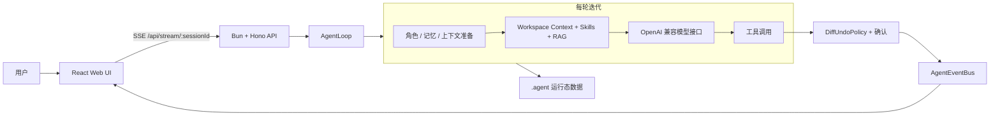
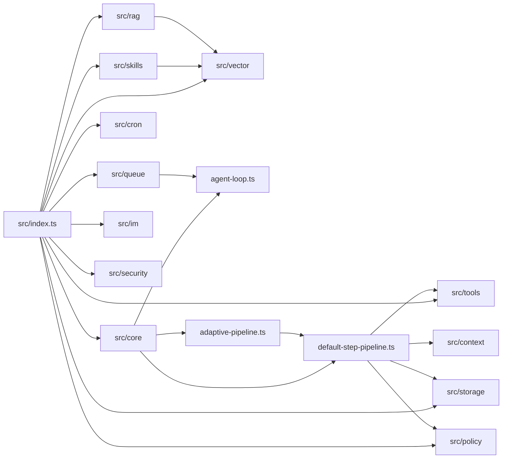

# AgentKit

AgentKit 是一个基于 **TypeScript + Bun** 的 AI Agent 开发框架。它把大模型调用、工具执行、技能复用、RAG 知识库、人工确认、前端对话界面和后端 API 放在同一个项目里，适合作为“可使用工具的企业内部 Agent”原型或二次开发底座。

## 项目定位

这个项目不是单纯的聊天 UI，而是一套完整的 Agent 执行链：

1. Web 前端通过 SSE 把用户输入发送到后端。
2. 后端按会话创建 `AgentLoop`，并根据 `projectPath`、角色、知识库和图片参数构造运行上下文。
3. `AgentLoop` 每轮调用 `AdaptivePipeline`，按任务类型在项目概览、计划执行和 ReAct 工具调用之间切换。
4. `DefaultStepPipeline` 负责角色注入、记忆压缩、Skills/RAG/工作区上下文检索、模型调用、工具调用解析、自动验证和降级处理。
5. 工具执行前经过策略检查。涉及文件写入等高风险操作时，通过事件总线推送确认请求，前端展示 diff 后由用户批准或拒绝。
6. 会话状态、模型配置、角色、技能、知识库、审计日志、定时任务和备份等运行态数据写入 `.agent/`。

## 核心能力

- **Agent 循环**：`src/core/agent-loop.ts` 负责多轮迭代、取消和恢复。
- **自适应管线**：`src/core/adaptive-pipeline.ts` 首轮判断任务形态；项目概览类请求会直接读取工作区元信息，避免被规划模型直答或 429 中断。
- **默认管线**：`src/core/default-step-pipeline.ts` 负责上下文准备、工具模式兼容、工具执行、重复调用检测、自动修复和验证摘要。
- **工作区理解**：内置 `repo_map`、`file_tree_summary`、`git_context`、`ts_symbols`，聊天上下文和 `/api/tools/workspace-context` 都可复用。
- **工具系统**：内置读写文件、Bash、Grep、Glob、ApplyPatch、EditFile、JsonQuery、Git、WebFetch、WebSearch、Skill 调用等工具。
- **写入策略**：`DiffUndoPolicy` 对写操作生成 diff 和备份，并通过 `/api/confirm` 等待用户确认。
- **Skills**：Markdown 格式的可复用步骤模板，存储在 `.agent/skills/`，支持元数据扫描、按需调用、导入和热重载。
- **RAG 知识库**：知识库存储在 `.agent/knowledge/`，支持文件上传、编辑、重建索引、搜索、chunk 查看和知识图谱。
- **模型配置**：模型、baseURL、API Key、温度、max tokens、embedding 配置保存在 `.agent/config.db`。
- **Web UI**：React + Vite + Ant Design / Ant Design X，包含对话、技能、市场、知识库、角色、工具、日志、审计、变更记录、定时任务和设置页面。
- **异步队列**：`/api/agents/async` 可接入 BullMQ + Redis 执行后台任务。
- **IM 适配**：预留企业微信、钉钉、飞书适配器，通过环境变量启用。

## 系统架构



## 核心模块依赖



## 目录结构

```text
.
├── src/                    # AgentKit 核心框架
│   ├── core/               # AgentLoop、AdaptivePipeline、DefaultStepPipeline、事件、验证、写入协议
│   ├── tools/              # 内置工具：文件、Bash、Git、RAG/工作区分析、Skill 等
│   ├── skills/             # 技能管理、导入、执行和模板
│   ├── rag/                # 知识库、文本切分、关键词索引、知识图谱
│   ├── vector/             # embedding 和向量存储
│   ├── memory/             # 会话记忆实现
│   ├── storage/            # SQLite / Redis 会话、模型、角色、运行态存储
│   ├── policy/             # 权限、确认、diff/undo 策略
│   ├── cron/               # 定时任务存储与调度
│   ├── queue/              # BullMQ 异步任务队列
│   ├── im/                 # 企业微信/钉钉/飞书消息适配
│   └── observability/      # 日志与遥测
├── server/                 # Hono API 服务
│   ├── main.ts             # Bun 服务入口，默认端口 3000
│   ├── api.ts              # 路由挂载、API 鉴权、图片上传、健康检查
│   ├── context.ts          # 全局 Skill/RAG/模型配置/MCP/日志实例
│   └── routes/             # chat、skills、knowledge、market、cron、roles、logs、tools 等路由
├── web/                    # React 前端
│   ├── src/pages/          # 对话、技能、市场、知识库、角色、工具、日志、审计、设置等页面
│   ├── src/components/     # 消息、确认框、工作区、diff、计划、侧边栏等组件
│   └── vite.config.ts      # dev server 代理 /api 到 localhost:3000
├── examples/               # 命令行 Agent 示例
├── tests/                  # Bun 测试
├── scripts/                # 索引、维护脚本
├── docs/                   # 设计文档和计划
├── setup.ts                # 初始化脚本
├── Dockerfile              # 后端 + 前端构建镜像
└── docker-compose.yml      # Redis、Agent、OTel Collector、Grafana 示例
```

## 快速启动

### 1. 安装依赖

```bash
bun install
cd web
bun install
cd ..
```

### 2. 配置环境变量

```bash
cp .env.example .env
```

至少需要配置：

```bash
OPENAI_API_KEY=sk-...
OPENAI_MODEL=gpt-4o
OPENAI_BASE_URL=https://api.openai.com/v1
```

如果使用 OpenAI 兼容服务，修改 `OPENAI_BASE_URL` 和 `OPENAI_MODEL` 即可。向量检索默认使用 embedding 模型，可通过下面变量单独配置：

```bash
EMBEDDING_API_KEY=sk-...
EMBEDDING_BASE_URL=https://api.openai.com/v1
OPENAI_EMBEDDING_MODEL=text-embedding-3-small
```

不需要 Skills/RAG 向量检索时，可以设置：

```bash
DISABLE_VECTOR_SEARCH=true
```

如果需要保护 `/api/*` 路由：

```bash
API_SECRET_TOKEN=your-token
```

### 3. 启动后端

```bash
bun run server
```

后端默认监听 `http://localhost:3000`，健康检查：

```bash
curl http://localhost:3000/health
```

### 4. 启动前端

```bash
bun run web
```

打开 `http://localhost:5173`。Vite 会把 `/api` 代理到 `http://localhost:3000`。

## 常用命令

```bash
bun run setup           # 执行初始化脚本
bun run server          # 启动 Hono 后端
bun run web             # 启动前端开发服务
bun run dev             # 启动 examples/dev-agent.ts 命令行示例
bun run index-project   # 建立项目索引
bun test                # 运行测试
cd web && bun run build # 构建前端
```

## 主要 API

| 路由 | 说明 |
| --- | --- |
| `GET /health` | 服务健康检查 |
| `GET /api/stream/:sessionId?input=...` | SSE 对话流，支持 `projectPath`、`kbIds`、`roleId`、`imageRef` |
| `POST /api/confirm` | 写操作 diff 确认 |
| `POST /api/upload/image` | 图片上传、压缩、临时保存 |
| `GET/PUT/POST /api/model-config` | 读取或更新模型与 embedding 配置 |
| `GET /api/tools` | 获取工具定义 |
| `GET /api/tools/workspace-context` | 获取工作区 repo map、文件树和 git 摘要 |
| `GET /api/skills` | 列出本地技能 |
| `GET /api/skills/:name` | 查看技能详情 |
| `DELETE /api/skills/:name` | 删除技能 |
| `POST /api/skills/reload` | 重载技能元数据 |
| `POST /api/skills/import` | 从 URL、zip 或上传文件导入技能 |
| `GET/POST/PUT/DELETE /api/knowledge` | 管理知识库 |
| `GET/POST/PUT/DELETE /api/knowledge/:id/files` | 管理知识库文件 |
| `POST /api/knowledge/:id/search` | 搜索知识库 |
| `POST /api/knowledge/:id/reindex` | 重建知识库索引 |
| `GET/POST/PUT/DELETE /api/cron` | 管理定时任务 |
| `POST /api/cron/:id/run` | 立即执行一次定时任务 |
| `GET/POST/DELETE /api/changelog` | 变更记录查询、创建和删除 |
| `POST /api/agents/async` | 提交 Redis/BullMQ 异步 Agent 任务 |
| `GET /api/agents/result/:jobId` | 查询异步任务结果 |
| `POST /api/agents/control` | 控制计划步骤：暂停、跳过、重试、继续 |
| `GET /api/agents/control/:sessionId` | 查询会话控制状态 |
| `GET/POST/PUT/DELETE /api/roles` | 角色管理 |
| `GET/PUT /api/logs/level` | 日志级别读取和更新 |
| `GET /api/logs/files` | 日志文件列表 |
| `GET /api/logs/query` | 日志查询 |
| `GET /api/logs/audit` | 审计日志查询 |
| `GET /api/logs/audit/timeline` | 会话时间线 |
| `POST /api/memory/extract` | 记忆提取预留接口 |
| `GET /api/market/skills` | 获取技能市场列表 |
| `GET /api/market/mcp` | 获取 MCP 市场列表 |
| `GET /api/market/plugins` | 获取插件市场列表 |
| `POST /api/market/*/install` | 安装技能、MCP 或插件 |
| `/im/*` | 企业微信、钉钉、飞书消息网关 |
| `/public/*` | 静态资源 |

## 聊天运行流程

`server/routes/chat.ts` 是 Web 对话的主要入口：

1. 前端请求 `GET /api/stream/:sessionId?input=...`。
2. 后端读取 query 参数：`projectPath`、`kbIds`、`roleId`、`imageRef`。
3. `createAgent` 使用 `.agent/config.db` 或环境变量构造模型配置。
4. `buildChatTools` 注册工作区隔离后的工具集合。
5. `AgentLoop` 调用 `AdaptivePipeline` 运行任务。
6. `AgentEventBus` 推送 `stream`、`plan`、`plan-step-update`、`confirm`、`summary-ready`、`final` 等事件。
7. 前端消费 SSE 并更新对话、计划、确认框、摘要和工作区状态。

## 项目概览类请求

当用户询问“了解当前项目”“项目概览”“项目介绍”“了解一下当前工作区这个项目”等问题时，`AdaptivePipeline` 不依赖首轮规划模型，而是直接读取工作区信息并生成结构化回答。

默认采集内容包括：

- `package.json`、`tsconfig.json`、`README.md`
- 目录结构
- 最近 git 提交和分支
- `src/index.ts`、`server/main.ts`、`server/api.ts`、`web/src/App.tsx`
- `.opencode/`
- `.agent/`
- `AGENTS.md`

这样可以避免模型把项目概览误判为“简单问题直接回答”，也避免 OpenRouter 等模型在规划阶段 429 时没有机会读取本地工作区。

## 运行态数据

项目运行时会自动创建 `.agent/`。常见内容包括：

```text
.agent/
├── skills/                  # 本地技能 Markdown
├── docs/                    # 旧版或通用文档目录
├── knowledge/               # 知识库文件、配置和索引
├── backups/                 # 文件修改备份
├── logs/                    # 运行日志
├── plugins/                 # 本地插件
├── config.db                # 模型配置 SQLite
├── cron.db                  # 定时任务 SQLite
├── roles.db                 # 角色配置 SQLite
├── session.db               # 会话状态 SQLite
├── changelog.db             # 变更记录 SQLite
├── audit.jsonl              # 工具、确认和时间线审计日志
├── vectors.json             # 向量缓存
├── vectors.sqlite           # 向量存储
└── *_memory.json            # 会话记忆
```

这些文件通常属于本地运行数据。是否提交到仓库，需要按部署方式和数据敏感性单独判断。

## 开发指南

### 添加工具

新工具应继承 `Tool` 抽象，并提供：

- `name`
- `description`
- `parameters`
- `executeCore(params)`

实现后在 `src/tools/index.ts` 导出，并在 `server/routes/chat.ts` 的 `buildChatTools` 中注册。需要暴露到工具列表时，同步更新 `src/core/tool.ts` 的工具定义收集逻辑。

### 添加页面

前端入口是 `web/src/App.tsx`。当前页面包括：

- `/` 对话
- `/skills` 技能
- `/market` 市场
- `/knowledge` 知识库
- `/cron` 定时任务
- `/settings` 设置
- `/roles` 角色管理
- `/tools` 工具列表
- `/logs` 日志
- `/audit` 审计
- `/changelog` 变更记录
- 文件查看和知识库文件编辑相关页面

### 添加知识库能力

知识库逻辑主要在 `src/rag/` 和 `server/routes/knowledge.ts`：

- 文档上传后进入 `.agent/knowledge/<id>/docs/`
- `KnowledgeBaseManager` 负责创建、删除、索引和检索
- embedding 配置来自 `.agent/config.db` 或环境变量
- 前端页面位于 `web/src/pages/KnowledgePage.tsx`

### 添加角色

角色存储在 `.agent/roles.db`，后端路由是 `/api/roles`，前端页面是 `RoleManagementPage.tsx`。聊天请求通过 `roleId` 选择角色，并在管线开始时注入角色提示词。

## Docker

```bash
docker compose up --build
```

`docker-compose.yml` 会启动 Redis、Agent、OpenTelemetry Collector 和 Grafana 示例服务。生产部署时需要补齐 `.env`，并根据实际需求决定是否启用 Redis、OTel 和 Grafana。

## 当前注意事项

- 当前工作区有较多运行态和开发中变更，提交前应重点检查 `.agent/`、`.opencode/`、数据库、日志和生成文件是否需要忽略。
- `/api/*` 支持 `API_SECRET_TOKEN` 鉴权；未配置时默认放行，生产环境建议显式配置。
- `examples/dev-agent.ts` 是命令行示例，若核心 `AgentLoop` 或模型配置构造方式继续变化，需要同步验证。
- `Dockerfile` 和前端 lockfile 路径需要按实际包管理文件确认。
- RAG 对复杂文档的效果取决于解析质量；PDF、Word、Excel 等文件需要先解析成稳定文本再索引。
- OpenRouter 免费模型或不稳定 provider 可能在工具调用、流式输出或规划阶段返回 429/5xx；项目概览请求已做本地确定性兜底，其他任务仍建议配置稳定模型。

## License

MIT
